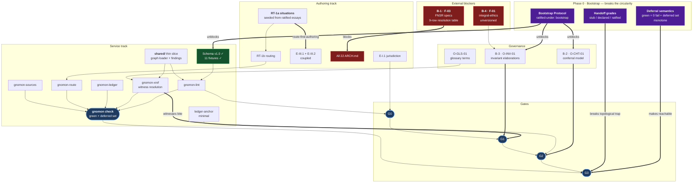

# Roadmap

**Status:** v0.3 — supersedes v0.2 after adversarial review (findings R-01…R-13, dispositioned
at §10). **Ratified under: bootstrap** — see §2.

**What this file is for.** GNOMON has two tracks that look independent and are not: **authoring**
produces essays, **services** produce the checks the gates depend on. They are coupled at the
gates — G0 needs lint green, G3 needs a corpus-wide green — and coupled again in the other
direction, since `gnomon-route` cannot be usefully built before situations exist to route. Work
either track alone for long and it stalls waiting on the other.

**What v0.2 got wrong.** It invented the deferred/passing distinction at the finest grain — the
individual check — and then forgot to apply it at every coarser grain. Checks could defer;
services, handoffs, governance, and the status table could not. Read strictly against its own
dependency graph, v0.2 **could not start** (Phase 0's outputs had no ratification path) and
**could not ratify** (G3 required five services, three of which arrived in Phases 4–5). §2 is
the repair, and it is the reason this version exists.

---

## 1. Where the corpus actually is

| | Planned | Exists | Conformant |
|---|---|---|---|
| Essays (formal) | 22 | 2 | — |
| Carriers | 22 | 1 | — |
| Architecture notes | 22 | 0 | **blocked — B-1** |
| Ledgers | 22 | 2 | 0 chained; **3 panels content-anchored** (pre-chain, 2026-08-23) |
| `jurisdiction.yaml` | 22 | 2 | 1 validates *against a G0 schema* † |
| `sources.lock` | 22 | 2 empty | 0 |
| Situations | window size **undecided** ‡ | 0 (5 placeholders) | — |
| Routes | ≥ 1 per essay | 0 | — |
| Gaps filed | — | 0 | — |
| Services | 5 + shared | 0 | — |
| Schema | 1 | 1 (v1.0, **bootstrap**) | verified against 11 fixtures |

† E-I.2's panel validates against a schema that is itself unratified. "Conformant" here means
*conformant to a proposal*, and it inherits that proposal's status. Marking it otherwise would be
the same flat assertion the corpus refuses everywhere else.
‡ v0.2 asserted "≥ 25 rolling" while O-RTG-01 (window size) was open. The initial value is
inherited from `README.md` with no argument attached; it is not a target until adjudicated.

**Triptych completeness: 3 of 66 panels, 0 of 22 topics.** No topic can complete today.

---

## 2. Bootstrap and partiality

> One defect produced most of v0.2's failures: **partiality was available to checks and to
> nothing else.** A check could report *deferred*. A service could not be partially built, a
> handoff could not be partially resolved, a governance artifact could not be partially ratified,
> and the status table could not say "conformant, provisionally." So every gate read as
> all-or-nothing, and the plan deadlocked.

Partiality is now defined at four grains. All four are **Phase 0 gate vocabulary** — they must
exist before the first gate is run, not discovered when one jams.

### 2.1 The Bootstrap Protocol · resolves R-01, R-11, D-C

`CHARTER.md` §2.3 refuses self-certification. But Phase 0 produces the artifacts that *make the
gates real* — invariant elaborations, the conferral model, review-independence criteria — and
those are themselves normative text requiring gates. Reviewed against what standard, when
O-INV-01 is being written in the same phase it would govern? Dispositioned by what role, when
O-CHT-01 defines the role? **The constitution cannot be constituted.**

v0.2 spotted this for the two essays (D-C) and missed that it applies with more force to
`INVARIANTS.md`, `SCHEMA.md`, and this file.

The resolution is to **mark the exception rather than hide it**:

| | Rule |
|---|---|
| **Who** | Governance and schema artifacts are provisionally self-ratified by the ratifying architect |
| **Mark** | Each carries `ratified-under: bootstrap` — machine-queryable by `gnomon-ledger` and `gnomon-xref`, never inferred from silence |
| **Sunset** | Mandatory re-ratification under the conferral model within **N review cycles** of O-CHT-01 closing. N is set in `CHARTER.md`; an artifact past sunset is a finding, not a grandfathered fact |
| **Scope** | Governance, schema, fixtures, roadmap. **Never essays** — corpus prose does not self-ratify under any circumstance |

This honours the charter by *declaring* the exception, which is exactly what the corpus does with
declared absences elsewhere. And it resolves D-C for free: **E-I.1 and E-I.2 restate as
provisional under the same mark**, upgrading when conferral exists. One mechanism, three problems.

**Currently bootstrap-marked:** `INVARIANTS.md` §Declaration · `services/gnomon-lint/SCHEMA.md` ·
`jurisdiction.schema.json` · the fixtures · this file. The mark is not yet mechanized —
`ratified-under` is not in any schema. That is item 0.1.

### 2.2 Deferral semantics · resolves R-04

**Green does not mean "all checks passed." It means: zero failures among implemented checks, with
the deferred set enumerated in the report.**

Without this, G2 and G3 are unreachable until Phase 5 — the graph makes `gnomon check` the
conjunction of five services, and three of them arrive late. With it, an essay can ratify in
Phase 3 against the checks that exist, with the rest named.

The rule that keeps it from becoming an excuse:

> **Deferral is monotone. The deferred set may only shrink. Any new deferral requires a ledger
> entry stating what was deferred, why, and its exit criterion.**

Without monotonicity, "green" quietly becomes negotiable exactly when the corpus grows and green
gets expensive — which is when it matters. Every gate report carries two lines: the disposition
and the deferred set. A report that omits the second is malformed.

### 2.3 Handoff grade scale · resolves R-05

v0.2's coupling table said `gnomon-xref` "grades resolution" and never defined the grades. Under
the strict reading — a handoff must resolve to a *ratified* target — E-I.2 cannot go green until
E-VI.1 ships in Phase 6, Phase 3's essays cannot ratify while pointing at Phase 6 targets, and by
induction almost nothing ratifies until nearly everything exists. A topological trap.

| Grade | Means | Present in corpus |
|---|---|---|
| `stub` | Directory exists with `STATUS.md` | All 4 of E-I.2's targets |
| `declared` | `jurisdiction.yaml` present and lints at G0 | 1 (E-I.2 itself) |
| `ratified` | Target at G3 | 0 |

**G3 requires every handoff target at ≥ `stub`, plus an open-handoff register** listing each
target below `ratified` with its expected phase. Deferral monotonicity applies: the register may
only shrink.

### 2.4 What partiality does *not* cover

INV-03's strata constraint. `character` and `destiny` may never be `licensed` or `defeasible` —
no grade, no deferral, no bootstrap exemption, at any gate. `INVARIANTS.md` §Declaration rules out
waiver, and that ruling is not softened by anything in this section.

---

## 3. Hard blockers

### B-1 · F-03 — the FNSR specs are unresolvable · highest leverage

Blocks **all 22 `ARCH.md` notes**, whose falsification condition is "cross-checked against service
specs; drift is a finding" — and therefore blocks triptych completeness for the entire corpus.
Also forces `gnomon-lint`'s `grounds:` check to report *deferred* rather than *passing*.

v0.2 called this the highest-leverage item and then sized it "S? — may be retrieval, may be
authoring elsewhere," a span of two orders of magnitude, with an exit criterion that assumed the
specs exist in vendorable states. **They do not, uniformly** — and that distribution is what
D-B turns on.

#### F-03 resolution table

**States below are reported from project history and are UNVERIFIED from this repository.**
Confirming them is item 0.4a; nothing downstream should treat a row as settled until it is.

| Service | Cited by | Reported state | Resolution action |
|---|---|---|---|
| **ARIADNE** | E-I.2 | ratified v1.0 | Vendor, or pin by stable id + version |
| **SHML** | E-II.1 | v3.3 | Pin v3.3 |
| **Will Observatory** | E-II.3, E-I.2 | v1.0-rc1, **F-08…F-32 open** | Pin rc + status. Cannot be cleanly drift-checked — a spec with open findings will drift by design |
| **ARCHON** | E-I.2, E-VI.1 | **unknown** | Assess first — highest stakes: grounds *when the synthetic person must say no* |
| **CTS** | E-I.2, E-II.2 | foundational-period, may be sketch | Assess |
| **NIS** | E-V.1 | foundational-period, may be sketch | Assess |
| **DES/CSS** | E-V.3 | foundational-period, may be sketch | Assess |
| **IEE** | E-I.1 | defined **in-corpus only** (Fruits §3.4) | Decide whether an external spec exists or the corpus definition is canonical |
| **Triple-I Standard** | `README.md`, `CHARTER.md` | Architectonic Agency Theory papers | Locate and vendor. The corpus's stated grounding is cited from nowhere reachable |

**What the distribution implies for D-B.** If the states above hold, neither "hold everything
incomplete" nor "vendor stubs and accept drift" is right, because the states are *heterogeneous*.
The answer is a fourth option v0.2 did not have: **status-graded `ARCH.md`** — a note pins
spec-version **plus status**, and drift-checking is graded per status (a `ratified` spec is
drift-checked strictly; an `rc-with-open-findings` spec is checked against its findings register;
a `sketch` spec grounds nothing and the note declares that as an absence). Added to D-B as (d).

### B-2 · O-CHT-01 — conferral model unspecified

Blocks **G2 for every artifact**. Mitigated for governance by §2.1; **not** mitigated for essays,
which never self-ratify.

### B-3 · O-INV-01 — invariants have no normative elaboration

Blocks **G1 for every artifact**. A reviewer can confirm a witness resolves; they cannot judge
conformance against a standard that does not exist.

### B-4 · F-01 — `integral-ethics.md` is unversioned and unratified · new in v0.3

Raised by R-09. The twelve worldviews and the tiered value ontology underlie the entire corpus;
E-VII.1 stress-tests them directly; `fruits-of-the-spirit/ESSAY.md` is formally a companion paper
to it. The document carries **no version, no status, no ratification record**, and v0.2 buried it
in a backlog cell as a note on one Phase 6 essay.

An essay cannot cite a foundation by version when the foundation has none (`foundations/README.md`
rule 3). **Exit:** version and status header exist upstream; dependent artifacts cite by version.

---

## 4. Dependency graph

---

## 5. Build order

Sizes are relative (S / M / L), not time.

### Phase 0 — Constitute

Nothing downstream is sound without this. Items 0.1–0.3 are the §2 vocabulary and come first.

| # | Item | Size | Note |
|---|---|---|---|
| **0.1** | **Bootstrap Protocol** into `CHARTER.md`; add `ratified-under` to the schema; mark existing artifacts | S | R-01. Unblocks every other Phase 0 item |
| **0.2** | **Deferral semantics** into the gate definitions; report contract carries the deferred set | S | R-04 |
| **0.3** | **Handoff grade scale** into gate definitions + `gnomon-xref` contract | S | R-05 |
| 0.4a | **F-03 confirmation** — verify the 9-row table | S | R-02. Retrieval, not authoring |
| 0.4b | **F-03 resolution** — vendor or pin per row | ? | Size known only after 0.4a |
| 0.5 | **O-INV-01** — elaborate INV-01…05 | M | B-3 |
| 0.6 | **O-CHT-01** — conferral model; set sunset N | M | B-2 |
| 0.7 | **O-CHT-02** — review independence | S | — |
| 0.8 | **O-GLS-01** — define ~8 pending terms | S | Gates `gnomon-xref` |
| 0.9 | **B-4 / F-01** — version `integral-ethics.md` | S | R-09 |
| **0.10** | **RT-1a — seed ~20 situations**, `provenance: internal` | M | R-03. See below |
| 0.11 | `coupled:` relation in schema | S | R-07 |

**0.10 is the change most likely to be skipped and should not be.** Situation *authoring* is
cheap and depends on nothing but a provisional provenance stance. v0.2 put situations in Phase 4
and thereby re-committed the exact mistake it diagnosed for witnesses: jurisdiction declarations
authored before any test case exists are well-formed strings accruing debt at authoring rate. The
Routing Test is the corpus's **only** empirical feedback on whether `decides` clauses carve at the
joints. Material is already in hand — the sleepover, the reporting employee, the suspended
accused, the spouse's filing cabinet, the 2 a.m. verdict all appear in the ratified essays.

Mark them `provenance: internal` and be honest that architect-authored situations are weaker
evidence than contributed ones (O-RTG-04). Weaker evidence beats none.

**Exit:** an essay drafted after this point can travel G0 → G3 without waiting on a definition,
and has live situations to be tested against.

### Phase 1 — First running service

| # | Item | Size | Note |
|---|---|---|---|
| 1.1 | **`shared/` thin slice** — graph loader + findings schema only | M | R-13. **Not** the full L item: browser host profile and dual-host equivalence gate the *service's own ratification*, not first internal use. Edge-Canonical requires the core stay pure, not that both hosts exist on day one |
| 1.2 | **`gnomon-lint`** — runner over the existing schema, then graph checks | M | Schema and fixtures already done |
| 1.3 | **`gnomon-xref`** — witness locators, handoff grading, carrier↔essay ids | M | See below |
| 1.4 | **`ledger-anchor`** — minimal: record and verify content hashes | S | R-06. Not full `gnomon-ledger`; enough that Phase 2–3 adjudications are anchored as they happen rather than reconstructed |
| 1.5 | **`gnomon check`** — ordered conjunction, disposition + deferred set | S | O-SVC-03 |

**Build `gnomon-xref` in Phase 1, not later.** The witness rule is what makes an invariant
declaration falsifiable — but until locators resolve, a witness is only a *well-formed string*.
Every essay authored before `xref` exists carries unverified witnesses that must be re-checked
afterward. That debt accrues at exactly the rate you author.

**Exit:** `gnomon check` runs; all 11 fixtures behave; the report distinguishes deferred from
passing and enumerates the deferred set.

### Phase 2a — Movement I conformance · gates Phase 3

| # | Item | Size |
|---|---|---|
| 2a.1 | **E-I.1 jurisdiction** — declare it (15 schema errors today) | M |
| 2a.2 | Conferral records, or restate v1.0/v2.0 as provisional under §2.1 | S |
| 2a.3 | O-JUR-J01 — review E-I.2's `[NEW]` proposed fields | S |
| 2a.4 | Re-anchor the pre-chain content anchors via 1.4 | S |

### Phase 2b — Movement I authoring · parallel, does **not** gate Phase 3

| # | Item | Size | Note |
|---|---|---|---|
| 2b.1 | **C-I.1 Fruits carrier** | L | R-08. A creative problem — no single-scene anchor — misclassified in v0.2 as conformance debt. Bundling it meant "pay down Movement I" stalled on finding a scene |

### Phase 3 — The open door · route-first

| # | Item | Size | Note |
|---|---|---|---|
| 3.1 | **E-III.1 Repentance** + **E-III.2 Forgiveness** | L + L | `coupled:` per 0.11 — shared G1, seam findings file against both, co-version at major level. Authored **against** the Phase 0 situations, not in the abstract |
| 3.2 | Carriers for both | M + M | CG |
| 3.3 | **E-III.3 Reconciliation** | L | Depends on 3.1 |
| 3.4 | **E-I.3 Conscience** | L | Closes the epistemology triangle |

Clears three of E-I.2's four handoff debts. Ratification is reachable here **because of §2.2 and
§2.3**, not despite the missing services.

### Phase 4 — The Routing Test runs

| # | Item | Size |
|---|---|---|
| 4.1 | O-RTG-05 — route schema | S |
| 4.2 | **`gnomon-route`** | M |
| 4.3 | **RT-1b** — adjudicate routes over the Phase 0 situations | M |
| 4.4 | First bidirectional coverage run | S |
| 4.5 | **`gnomon-ledger`** — full chain | M |
| 4.6 | O-RTG-01 — settle the window size with real data | S |

### Phase 5 — Architecture leverage → **mandatory re-plan**

| # | Item | Size | Note |
|---|---|---|---|
| 5.1 | **E-II.1** + **E-II.2** | L + L | Pair. SHML, CTS |
| 5.2 | **E-VI.1 Authority & Refusal** | L | R-09. Pulled forward from Phase 6: the leverage criterion that ordered this phase argues for it — ARCHON is the highest-stakes grounding in the corpus |
| 5.3 | **E-II.3 Display** | L | **Transitively F-03-blocked** — must agree with A-I.1, which is blocked |
| 5.4 | **`gnomon-sources`** + first pins | M | — |
| 5.5 | ARCH notes, status-graded | M each | Only per resolved F-03 rows |

**Exit is a re-plan.** Roadmap **v0.4 is mandatory** at Phase 5 exit.

### Phase 6 — Unplanned

**This phase is acknowledged as unplanned, not planned thinly.** Movements IV, V, VII remain, in
roughly that order, with E-VII.4 last (it closes the loop to E-I.1). Sequencing is deferred to
v0.4, when routing evidence exists to order it with.

**Exit: first completeness evaluation attempted** — pass or fail. v0.2 gave this phase no exit at
all, which meant the corpus's own definition of done was owned by no phase.

### The preemption rule

> **A filed `GAP-###` preempts the planned queue.**

Gaps are evidence; the backlog is conjecture. A roadmap that lets conjecture outrank evidence has
quietly stopped being falsifiable — and this document's 22-row queue is exactly the kind of
conjecture that would. When a situation routes nowhere, the gap becomes the backlog head
regardless of what phase says otherwise.

---

## 6. Coupling points

| Coupling | Direction | Consequence |
|---|---|---|
| G0 requires lint green | Service → Authoring | No essay exits draft until Phase 1 |
| G3 requires `gnomon check` green | Service → Authoring | Reachable early **only** under §2.2 deferral semantics |
| Handoff targets must reach ≥ `stub` | Authoring → Authoring | Under §2.3; the strict reading was a topological trap |
| `gnomon-route` needs situations | Authoring → Service | Route unbuildable before cases exist |
| `gnomon-xref` resolves witnesses | Service → Authoring | Pre-xref essays carry unverified witnesses |
| `ARCH.md` needs FNSR specs | External → Authoring | 22 notes blocked |
| Ledger needs conferral records | Governance → Service | A chain over unwitnessed adjudication proves only that nobody edited the unwitnessed thing |
| Each new essay adds handoff targets | Authoring → Service | Grows the open-handoff register |
| **Governance definitions land late** | **Governance → Authoring** | *New (R-12).* Essays drafted before O-INV-01 need re-review against elaborations that did not exist when written — D-D's real cost |
| **F-03 unresolved** | **External → Service** | *New (R-12).* `gnomon-lint`'s `grounds:` check must report deferred, never passing |

---

## 7. Decisions

| # | Decision | Status |
|---|---|---|
| **D-A** | Phase 2a before Phase 3? | **Decided: yes.** 2a is S/M conformance work gating Phase 3; 2b (the carrier) runs parallel and does not gate |
| **D-B** | If F-03 cannot clear, what happens to triptych completeness? | **Open — the most consequential in the project.** (a) hold all topics incomplete (b) make `ARCH.md` conditional (c) vendor stubs, accept drift (d) **status-graded `ARCH.md`** — new in v0.3, and the option the reported spec distribution actually points to. **Cannot be decided before 0.4a** |
| **D-C** | Ratify E-I.1/E-I.2 retroactively, or restate as provisional? | **Resolved by §2.1.** Restate as provisional under `ratified-under: bootstrap`; upgrade when conferral exists |
| **D-D** | Draft ahead of the gates? | **Decided: no — option (a).** v0.2 listed this as open while its entire phase structure assumed (a); a decision table containing an already-made decision is theater. *Delta under (b):* Phase 3 could start immediately, at the cost of re-review against O-INV-01 and re-anchoring under 1.4 |
| **D-E** | Service implementation language | **Open.** Edge-Canonical implies JS/TS. No `node_modules` committed; schema and fixtures are language-agnostic and stay that way |
| **D-F** | Sunset N for bootstrap marks | **Open — new.** How many review cycles after O-CHT-01 closes before a bootstrap artifact must be re-ratified. Set in `CHARTER.md` at 0.6 |

---

## 8. Essay backlog

Phases per §5. Status: **R** ratified · **—** not started.

| ID | Essay | Formal | Carrier | Arch | Phase | Notes |
|---|---|---|---|---|---|---|
| E-I.1 | The Fruits of the Spirit | **R** v2.0 *prov.* | — | — | 2a/2b | Jurisdiction undeclared; carrier C-I.1; A-I.1 blocked; v2.0 unverified |
| E-I.2 | Judge Not | **R** v1.0 *prov.* | **R** v1.0 | — | 2a | Panel validates against a bootstrap schema; A-I.2 blocked |
| E-I.3 | Conscience | — | — | — | 3 | Erring conscience; formation vs. scrupulosity; refusal |
| E-II.1 | Truthfulness | — | — | — | 5 | Grounds SHML (v3.3) |
| E-II.2 | Promise & Covenant | — | — | — | 5 | Pair with E-II.1. Grounds CTS (state unknown) |
| E-II.3 | Display | — | — | — | 5 | **Transitively F-03-blocked.** Grounds Will Observatory (rc1, findings open) |
| E-III.1 | Repentance | — | — | — | 3 | **P0**, coupled to E-III.2 |
| E-III.2 | Forgiveness | — | — | — | 3 | **P0**, coupled to E-III.1 |
| E-III.3 | Reconciliation | — | — | — | 3 | Depends on 3.1 |
| E-VI.1 | Authority & Refusal | — | — | — | **5** | **Pulled forward.** Grounds ARCHON — highest-stakes grounding, and ARCHON's state is unknown |
| E-IV.1…4 | Claims of Others | — | — | — | 6 | Unplanned — v0.4 |
| E-V.1…3 | Formation | — | — | — | 6 | Unplanned — v0.4 |
| E-VI.2 | The Community's Acts | — | — | — | 6 | Depends on E-VI.1 |
| E-VII.1 | Two Masters | — | — | — | 6 | Depends on **B-4** |
| E-VII.2…3 | Tragedy, Suffering | — | — | — | 6 | Unplanned — v0.4 |
| E-VII.4 | Hope & Completion | — | — | — | 6 | Closes the loop to E-I.1. **Last** |

---

## 9. Open-item register

| Id | Owner | Item | Phase |
|---|---|---|---|
| **F-01** | `foundations/` | **B-4** — `integral-ethics.md` unversioned | 0.9 |
| **F-02, F-04** | `foundations/` | Licensing; inherited blocked readiness | 0 |
| **F-03** | `foundations/` | **B-1** — 9-row resolution table | 0.4 |
| **O-INV-01** | `INVARIANTS.md` | **B-3** — elaborations | 0.5 |
| ~~O-INV-02~~ | — | **CLOSED** — witness rule, two statuses, no waiver | — |
| **O-INV-03** | `INVARIANTS.md` | Partial — INV-03 mechanical; four declaration-only | 1 |
| **O-INV-04, 05** | `INVARIANTS.md` | Precedence; supersession | 0 |
| **O-CHT-01** | `CHARTER.md` | **B-2** — conferral model + sunset N | 0.6 |
| **O-CHT-02…04** | `CHARTER.md` | Independence; contribution; retroactive conferral | 0, 2a |
| **O-CHT-05** | `CHARTER.md` | **New** — Bootstrap Protocol | 0.1 |
| **O-SPN-01…03** | `SPINE.md` | Stage definitions; scale rule; self-coverage | 1 |
| **O-GLS-01…03** | `GLOSSARY.md` | Terms; enforcement; homonyms | 0.8 |
| ~~O-JUR-01~~ | — | **CLOSED** — schema v1.0 | — |
| **O-JUR-F01 / J01** | Panels | Declare E-I.1; review E-I.2's `[NEW]` fields | 2a |
| **O-SCH-01…04** | `SCHEMA.md` | Locators; `decides` overlap; ratification; canonicity | 1 |
| **O-SCH-05** | `SCHEMA.md` | **New** — `ratified-under` and `coupled:` fields | 0.1, 0.11 |
| **O-SVC-01…04** | `services/` | Contracts; drift-check; gate order; host equivalence | 1 |
| **O-RTG-01…05** | `routing/` | Window size; contested routing; gap mechanics; provenance; route schema | 0.10, 4 |
| **O-LDG-\*** | Ledgers | Conferral; classification; chain; **re-anchor pre-chain hashes** | 2a, 4 |
| **O-RDM-02** | this file | E-I.1 v2.0 unverified | 2a |

---

## 10. Review disposition — v0.2 → v0.3

| Finding | Disposition | Location |
|---|---|---|
| **R-01** Bootstrap circularity | **ACCEPT** — Bootstrap Protocol with `ratified-under: bootstrap` mark and sunset; resolves D-C | §2.1, 0.1, D-C, D-F |
| **R-02** F-03 under-examined | **ACCEPT** — 9-row resolution table; split into confirm (0.4a) / resolve (0.4b); D-B gains option (d) | §3 B-1, D-B |
| **R-03** Situations too late | **ACCEPT** — RT-1 split; ~20 situations seeded at 0.10; Phase 3 authored route-first | 0.10, Phase 3 |
| **R-04** G3 unreachable | **ACCEPT** — deferral semantics with monotonicity into gate definitions | §2.2, 0.2 |
| **R-05** Handoff grades undefined | **ACCEPT** — three-grade scale; G3 requires ≥ `stub` + open-handoff register | §2.3, 0.3 |
| **R-06** Ledger timing; unprotected texts | **ACCEPT** — `ledger-anchor` to 1.4; **SHA-256 anchors recorded 2026-08-23** in both ledgers, with the byte-stream trap documented | 1.4, 2a.4, both `LEDGER.md` |
| **R-07** Pairing has no mechanism | **ACCEPT** — `coupled:` relation proposed; shared G1, seam findings, co-versioning | 0.11, 3.1 |
| **R-08** Phase 2 gated on a creative item | **ACCEPT** — split 2a (conformance, gates) / 2b (carrier, parallel) | Phase 2a, 2b |
| **R-09** Phase 6 dumping ground | **ACCEPT** — B-4 registered; E-II.3 flagged transitively blocked; E-VI.1 pulled to Phase 5; v0.4 mandatory at Phase 5 exit; Phase 6 declared unplanned | §3 B-4, 5.2, 5.3, Phase 6 |
| **R-10** Completeness unowned | **ACCEPT** — Phase 6 exit is first evaluation attempted; gap-preemption rule stated | Phase 6, §5 |
| **R-11** D-D theater; flat assertions | **ACCEPT** — D-D marked decided with delta; window size and "conformant" both marked provisional | D-D, §1 †‡ |
| **R-12** Missing couplings | **ACCEPT** — both added | §6 |
| **R-13** `shared/` on critical path | **ACCEPT** — thin core slice; dual-host equivalence gates the service's ratification, not first use | 1.1 |

**All 13 accepted; none rejected, none deferred.** A review cycle producing no findings is itself
a finding — this one produced thirteen, and two of them (R-01, R-04) were blocking defects that
made the plan unrunnable as written.

---

## 11. Session log

| Date | Change | Artifacts |
|---|---|---|
| 2026-08-23 | Repository scaffold built to the `README.md` layout; prose relocated into triptych directories; `foundations/` established; license split executed; governance, routing, services, fixtures stubbed. No normative text authored. | repository-wide |
| 2026-08-23 | **SVC-1 unblocked.** `jurisdiction.yaml` schema v1.0, fixing five v0 defects. Declaration vocabulary fixed (witness required; no waiver). Both panels migrated — E-I.2 clean, E-I.1 fails on 15 real defects. Green base + ten red one-factor deltas verified failing at expected paths. | `INVARIANTS.md`, `services/gnomon-lint/`, both panels, `fixtures/` |
| 2026-08-23 | Roadmap v0.2: dependency graph, six-phase order, coupling points. Surfaced B-1. | `ROADMAP.md` |
| 2026-08-23 | **Roadmap v0.3** after adversarial review. Thirteen findings, all accepted. Root defect: partiality defined for checks and nothing else, leaving a plan that could not start (R-01) or ratify (R-04). Added the Bootstrap Protocol, deferral monotonicity, handoff grades, the F-03 resolution table, and the gap-preemption rule; pulled situations to Phase 0. **Content anchors recorded for all three ratified panels.** | `ROADMAP.md`, both `LEDGER.md` |
