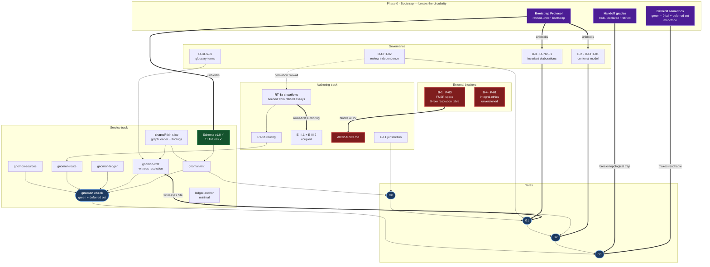

# Roadmap

**Status:** v0.3.3 — Phase 0-alpha closed. Supersedes v0.3.2. **Ratified under: bootstrap** ·
`bootstrap-entry: BE-006` — see §2.1.

**What v0.3.2 fixes.** Three items landed after v0.3.1 was written — 0.12 fixture harness, 0.4a
F-03 confirmation, 0.13 precedent review — and the document was edited in place without a version
bump, leaving ten defects. Two are self-contradictions this file would fail its own review on:
§3 argued both that CTS may be sketch-grade *and* that 0.4a proved it is not, and §2.1 forbade a
second bootstrap registry while keeping one four lines later. Full list at §10.3.

**Why a point release before Phase 0 runs.** v0.3's four load-bearing repairs were sound in
design and three carried defects introduced *by the repair*: the bootstrap mark was overloaded
across two opposite operations (R-14), monotonicity was stated as set-shrinkage over two sets
that legitimately grow (R-15), and D-B was enacted in the build order while marked open (R-16) —
the exact defect v0.3 convicted v0.2 of. All three sit in items 0.1–0.3, the vocabulary
everything else is built on, and R-17 changes 0.10's schema. They could not wait for the
Phase-5-mandated v0.4.

**What this file is for.** GNOMON has two tracks that look independent and are not: **authoring**
produces essays, **services** produce the checks the gates depend on. They are coupled at the
gates — G0 needs lint green, G3 needs a corpus-wide green — and coupled again in the other
direction, since `gnomon-route` cannot be usefully built before situations exist to route. Work
either track alone for long and it stalls waiting on the other.

**What v0.2 got wrong.** It invented the deferred/passing distinction at the finest grain — the
individual check — and then forgot to apply it at every coarser grain. Checks could defer;
services, handoffs, governance, and the status table could not. Read strictly against its own
dependency graph, v0.2 **could not start** (Phase 0's outputs had no ratification path) and
**could not ratify** (G3 required five services, three of which arrived in Phases 4–5). §2 is
the repair, and it is the reason this version exists.

---

## 1. Where the corpus actually is

| | Planned | Exists | Conformant |
|---|---|---|---|
| Essays (formal) | 22 | 2 | — |
| Carriers | 22 | 1 | — |
| Architecture notes | 22 | 0 | **blocked — B-1** |
| Ledgers | 22 + governance | 2 + `LEDGER.md` | 0 chained; **3 panels content-anchored** (pre-chain) |
| `jurisdiction.yaml` | 22 | 2 | 1 validates *against a G0 schema* † |
| `sources.lock` | 22 | 2 empty | 0 |
| Situations | window size **undecided** ‡ | 0 (5 placeholders) | — |
| Routes | ≥ 1 per essay | 0 | — |
| Gaps filed | — | 0 | — |
| Services | 5 + shared | 0 | — |
| Tensions logged | — | **4** (1 inherited, 1 irreducible) | `TENSIONS.md`, new at 0.13 |
| Schema | 1 | 1 (v1.0, **bootstrap**) | **witnessed** against 11 fixtures § |

† E-I.2's panel validates against a schema that is itself unratified. "Conformant" here means
*conformant to a proposal*, and it inherits that proposal's status. Marking it otherwise would be
the same flat assertion the corpus refuses everywhere else.
‡ v0.2 asserted "≥ 25 rolling" while O-RTG-01 (window size) was open. The initial value is
inherited from `README.md` with no argument attached; it is not a target until adjudicated.

§ **This cell read "verified" from 2026-08-23 until 0.12 landed, and it should not have.** The
verifier lived in a scratch directory and was discarded, so the conformance claim had no witness
that anyone could re-run — declared, not witnessed, in the corpus's own vocabulary, and therefore
the red discipline was reassurance for exactly as long as the cell said otherwise. It now reads
*witnessed* because `tools/fixture-harness` is committed and runs in CI. The distinction is the
one `services/README.md` draws between mechanical and adjudicated, applied one level up: a claim
about a check is worth what its witness is worth.

**Triptych completeness: 3 of 66 panels, 0 of 22 topics.** No topic can complete today.

---

## 2. Bootstrap and partiality

> One defect produced most of v0.2's failures: **partiality was available to checks and to
> nothing else.** A check could report *deferred*. A service could not be partially built, a
> handoff could not be partially resolved, a governance artifact could not be partially ratified,
> and the status table could not say "conformant, provisionally." So every gate read as
> all-or-nothing, and the plan deadlocked.

Partiality is now defined at four grains. All four are **Phase 0 gate vocabulary** — they must
exist before the first gate is run, not discovered when one jams.

### 2.1 The Bootstrap Protocol · resolves R-01, R-11, D-C

> **Normative text now lives at `CHARTER.md` §4** (specified 2026-08-24, closing O-CHT-05). What
> follows is the roadmap's summary of why the protocol exists and what it does for sequencing.
> Where this section and `CHARTER.md` §4 disagree, **§4 governs** and the divergence is a finding.
> The registry of marked artifacts is `CHARTER.md` §4.10 (and `LEDGER.md` §1), not here — one
> register, not two.

`CHARTER.md` §2.3 refuses self-certification. But Phase 0 produces the artifacts that *make the
gates real* — invariant elaborations, the conferral model, review-independence criteria — and
those are themselves normative text requiring gates. Reviewed against what standard, when
O-INV-01 is being written in the same phase it would govern? Dispositioned by what role, when
O-CHT-01 defines the role? **The constitution cannot be constituted.**

v0.2 spotted this for the two essays (D-C) and missed that it applies with more force to
`INVARIANTS.md`, `SCHEMA.md`, and this file.

The resolution is to **mark the exception rather than hide it**.

#### Two marks, not one · corrected in v0.3.1 (R-14)

v0.3 used a single mark for both governance artifacts and the two ratified essays, and thereby
contradicted itself inside one section: the scope rule said *never essays*, and the next
paragraph restated E-I.1 and E-I.2 "under the same mark."

The contradiction was a symptom. **One mark was carrying two opposite operations.** For a
governance artifact, the mark *grants* provisional normative force — the artifact functions as
authority until re-ratified. For a ratified essay, the operation is a *withdrawal* — prose whose
ratification claim has no conferral record behind it, carrying no self-conferred force at all.
Sunset does not even apply coherently to the second: what is an essay past sunset, when it never
self-ratified in the first place?

They are separate fields, with disjoint scopes and different exits:

| | `ratified-under: bootstrap` | `ratification: pending-conferral` |
|---|---|---|
| **Applies to** | Governance, schema, fixtures, roadmap | Essays and carriers — all corpus prose |
| **Operation** | **Grants** provisional normative force; self-ratified by the ratifying architect | **Withholds** it; a ratification claim not backed by a conferral record |
| **Normative force** | Yes, provisional | **None.** Corpus prose does not self-ratify under any circumstance |
| **Exit** | Sunset — mandatory re-ratification within N of O-CHT-01 closing | First true conferral under the conferral model |
| **Past its exit** | A finding, not a grandfathered fact | No sunset applies; it holds until conferred |

Both are machine-queryable and never inferred from silence. The scopes are **disjoint by
construction**: a query for self-ratified governance MUST NOT return corpus prose, and §2.1's own
queryability requirement is what forbids the overload.

This honours the charter by *declaring* the exception rather than hiding it, which is what the
corpus does with declared absences everywhere else.

**Where the marked artifacts are listed:** `CHARTER.md` §4.10 and `LEDGER.md` §1, and nowhere
else. v0.3.1 kept its own copy of that list here — four lines below a note forbidding exactly
that, so the "one register, not two" rule was violated inside the section stating it. The list has
since grown from five entries to twelve, and the copy here was already stale. Removed rather than
refreshed: a second register that must be manually synchronised is the defect, not its contents.

Neither mark is mechanized — neither field is in any schema. That is item 0.1 (O-CHT-06).

### 2.2 Deferral semantics · resolves R-04

**Green does not mean "all checks passed." It means: zero failures among implemented checks, with
the deferred set enumerated in the report.**

Without this, G2 and G3 are unreachable until Phase 5 — the graph makes `gnomon check` the
conjunction of five services, and three of them arrive late. With it, an essay can ratify in
Phase 3 against the checks that exist, with the rest named.

The rule that keeps it from becoming an excuse — **restated in v0.3.1 (R-15)**:

> **1 · No element regresses.** A check that has reported *passing* never returns to *deferred*.
> A regression is permitted only as a recorded finding, never as a status change.
>
> **2 · The universe grows only by admission.** New checks may enter the check universe — that is
> what building services *is* — but each entry is admitted with a ledger record naming what is
> deferred, why, and its exit criterion. Growth by admission is healthy; growth unrecorded is the
> failure.

**What v0.3 got wrong.** It said "the deferred set may only shrink," and then in the next sentence
regulated the new deferrals that shrinkage forbids. Set-shrinkage is simply the wrong invariant:
the deferred set *must* be able to grow, because every service built adds checks that nothing has
run yet. Under v0.3's wording, implementing `gnomon-route` would have violated §2.2 by existing.

The right invariant is **per-element no-regression plus admission-controlled universe growth.**
The check universe carries a version; a bump requires a ledger entry. What may never happen is a
check silently leaving *passing*.

Without this, "green" quietly becomes negotiable exactly when the corpus grows and green gets
expensive — which is when it matters. Every gate report carries two lines: the disposition and
the deferred set. A report that omits the second is malformed.

### 2.3 Handoff grade scale · resolves R-05

v0.2's coupling table said `gnomon-xref` "grades resolution" and never defined the grades. Under
the strict reading — a handoff must resolve to a *ratified* target — E-I.2 cannot go green until
E-VI.1 ships in Phase 6, Phase 3's essays cannot ratify while pointing at Phase 6 targets, and by
induction almost nothing ratifies until nearly everything exists. A topological trap.

| Grade | Means | Present in corpus |
|---|---|---|
| `stub` | Directory exists with `STATUS.md` | All 4 of E-I.2's targets |
| `declared` | `jurisdiction.yaml` present and lints at G0 | 1 (E-I.2 itself) |
| `ratified` | Target at G3 | 0 |

**G3 requires every handoff target at ≥ `stub`, plus an open-handoff register** listing each
target below `ratified` with its expected phase.

**Monotonicity here, corrected in v0.3.1 (R-15).** §2.2's two rules apply unchanged, and the same
mistake was made here: v0.3 said "the register may only shrink" while §6 says, correctly, that
each new essay *grows* it. Both cannot hold, and the register is the one that must give — a
corpus that cannot add handoff targets cannot add essays.

- **No target regresses.** A handoff target that has reached a grade never descends to a lower
  one except as a recorded finding.
- **New targets enter by admission.** Each is admitted to the register tagged with its expected
  phase. §6's "each new essay adds handoff targets" is this channel operating normally, not a
  violation.

### 2.4 What partiality does *not* cover

INV-03's strata constraint. `character` and `destiny` may never be `licensed` or `defeasible` —
no grade, no deferral, no bootstrap exemption, at any gate. `INVARIANTS.md` §Declaration rules out
waiver, and that ruling is not softened by anything in this section.

---

## 3. Hard blockers

### B-1 · F-03 — the FNSR specs · **located 2026-08-24; still blocking**

Blocks **all 22 `ARCH.md` notes**, whose falsification condition is "cross-checked against service
specs; drift is a finding" — and therefore blocks triptych completeness for the entire corpus.
Also forces `gnomon-lint`'s `grounds:` check to report *deferred* rather than *passing*.

**0.4a is executed.** Every row is located in `Skreen5hot/ariadne` and carries a version. The
blocker did not clear; it changed shape:

| | Before 0.4a | After 0.4a |
|---|---|---|
| **Feared** | The specs may not exist in citable form | — |
| **Actual** | — | They exist, are versioned, and are actively maintained. **The corpus has never been checked against any of them** |
| **Character** | Possibly generative — write the spec downstream of the essay | **Blocking.** Drift is accumulated and unmeasured across nine documents |

An `ARCH.md` can now be *written*. What it cannot yet be is *checked*: O-SVC-02 has not decided
whether drift-checking is mechanical or adjudicated, and ARIADNE turns out to carry its own drift
machinery (`00-foundation/drift-record.md`, `tension-log.md`, `coherence-review.md`,
`04-governance/drift_report.md`). That changes the question from "how do we build one" to "do we
consume theirs." Raised as **O-SVC-06**.

#### F-03 resolution table — **0.4a executed 2026-08-24**

**The specs are located.** All nine rows resolve into
[`Skreen5hot/ariadne`](https://github.com/Skreen5hot/ariadne) under `docs/`, which also carries
its own coherence machinery (`spec-index.md`, `drift-record.md`, `tension-log.md`,
`service_inventory.json`).

**Evidence class:** version and status lines read from each document's header at
`main`, 2026-08-24. That is stronger than the previous *reported* column and weaker than a
ratification record — **a header is a self-declaration**, and `CHARTER.md` §2.3 does not accept
self-declaration as conferral. Rows are therefore *located and versioned*, not *ratified*.

| Service | Cited by | Location in `ariadne/docs/` | Verified header | Was reported |
|---|---|---|---|---|
| **ARCHON** | E-I.2, E-VI.1 | `01-philosophy/archon-framework.md`<br>`03-specifications/archon-functional-requirements.md` | **v2.0** "Publication Draft"<br>**v3.0** "Draft for Technical Review" | *unknown* — now known, and it is **two documents at different versions** |
| **CTS** | E-I.2, E-II.2 | `03-specifications/CTS-Commitment-Tracking-Service-v1.2.md` | **v1.2.1** · "Ready for Milestone 1 Implementation" | ~~may be sketch~~ **wrong** |
| **NIS** | E-V.1 | `03-specifications/NIS-Specification-v2.1.md` | **v2.1 FINAL** · "Governance-Ready" | ~~may be sketch~~ **wrong** |
| **DES** | E-V.3 | `03-specifications/DES-Specification-v2.0.md` | **v2.0.0** · "Release Candidate" | ~~may be sketch~~ **wrong** |
| **CSS** | E-V.3 | `03-specifications/CSS-Specification-v2.0.md` | **v2.0.0** · "Final" | ~~may be sketch~~ **wrong** |
| **SHML** | E-II.1 | `03-specifications/SHML-v3_3.md` | **v3.3** · "Normative Draft" | v3.3 ✓ — status now known |
| **IEE** | E-I.1 | `03-specifications/Integral_Ethics_Agent.md` | **v2.1** · "Reference Architecture" | ~~in-corpus only~~ **wrong** — an external spec exists |
| **Will Observatory** | E-II.3, E-I.2 | `02-architecture/FNSR Will Observatory and Commitment Architecture.md` | **v1.0 Final** (conceptual) · *"Subsystem specifications remain to be separately ratified. No implementation is conformant merely by claiming conformance to this conceptual document."* | ~~v1.0-rc1, F-08…F-32 open~~ — the rc1 document is a **different** file (`02-architecture/fnsr-conceptual-design-document-v1.0-rc1.md`) |
| **Triple-I Standard** | `README.md`, `CHARTER.md` | `01-philosophy/FNSR-Justification.md` §4.2 "The Triple-I Substrate & ARCHON Protocol" | Irreversibility · Inseparability · **Integrity-Maintenance** | located — **but see R-32: a second, conflicting triad exists upstream** |
| **ARIADNE** | E-I.2 | repository root | **no version, no status.** Not a service spec — a coherence-review *discipline* over the spec ecosystem | ~~ratified v1.0~~ **wrong on both counts** |

#### What 0.4a overturned

**The "mostly sketch-grade" hypothesis is false.** Seven of nine rows are versioned documents at
Final, Release Candidate, Governance-Ready, or Normative Draft. Only ARIADNE lacks a version, and
it is not a service.

This **inverts R-18's expected consequence.** R-18 reasoned that if CTS were sketch-grade then
E-II.2 would not be blocked by CTS — CTS would be blocked by E-II.2, with the essay upstream. CTS
is v1.2.1 and implementation-ready, so that inversion applies to **no row in this table**.
`essay-upstream` remains a valid status in D-B(d)'s grading; it currently has **zero occupants**.

**B-1's character therefore changes, and not in the comfortable direction.** The blocker was never
"the specs might not exist." It is that **real, versioned, actively-maintained specs exist and the
corpus has never been checked against them.** Drift risk is not hypothetical here — it is
accumulated and unmeasured, across nine documents the corpus claims to ground.

**D-B(d) survives and is strengthened.** The states are genuinely heterogeneous — Final, RC,
Governance-Ready, Normative Draft, Publication Draft, Reference Architecture, and one document
with no version at all. A single drift-check rule cannot serve all of them, which is exactly the
argument for status-graded `ARCH.md`.

#### `essay-upstream` — retained, and falsified by 0.4a · R-18, superseded

**This subsection records a prediction that turned out to be wrong.** It is retained rather than
deleted: the reasoning was sound and only its premise was false, and a roadmap that quietly removes
its own falsified forecasts cannot be checked against its history.

R-18 argued that if a spec is sketch-grade the grounding direction inverts — the essay becomes the
upstream artifact and the spec is written against it, which is the project's own logic from
`README.md` (*you cannot ground an agent in an ethics no one has specified*). On that reasoning
B-1 would split into a blocking half and a generative half.

**0.4a falsified the premise.** CTS is v1.2.1 and implementation-ready; NIS v2.1 FINAL; DES v2.0.0
Release Candidate; CSS v2.0.0 Final. No row in the table is sketch-grade, so the split does not
occur and `essay-upstream` survives as a valid status in D-B(d) with **zero occupants**.

What the reasoning still buys: the status exists for the case it described, so a future citation
landing on a genuine sketch already has somewhere to go.

**D-B(d)'s grading, which stands:**

| Spec status | Drift check |
|---|---|
| `ratified` | Strict — any divergence is a finding |
| `rc-with-open-findings` | Against the spec's findings register; divergence on an open finding is expected, not a defect |
| `sketch` | Grounds nothing; the note declares that as an absence |
| `essay-upstream` | Inverted — the spec is drift-checked against the essay. **Zero occupants as of 0.4a** |

### B-2 · O-CHT-01 — conferral model unspecified

Blocks **G2 for every artifact**. Mitigated for governance by §2.1; **not** mitigated for essays,
which never self-ratify.

### B-3 · O-INV-01 — invariants have no normative elaboration

Blocks **G1 for every artifact**. A reviewer can confirm a witness resolves; they cannot judge
conformance against a standard that does not exist.

### B-4 · F-01 — `integral-ethics.md` is unversioned and unratified · new in v0.3

Raised by R-09. The twelve worldviews and the tiered value ontology underlie the entire corpus;
E-VII.1 stress-tests them directly; `fruits-of-the-spirit/ESSAY.md` is formally a companion paper
to it. The document carries **no version, no status, no ratification record**, and v0.2 buried it
in a backlog cell as a note on one Phase 6 essay.

An essay cannot cite a foundation by version when the foundation has none (`foundations/README.md`
rule 3). **Exit:** version and status header exist upstream; dependent artifacts cite by version.

**Partially evidenced 2026-08-24 (0.13).** ARIADNE's `spec-index.md` lists *Integral Ethics · —
(no version) · **Stable** · reviewed 2026-01-30 · PASS (1 flag)*. A **status** exists upstream; a
**version** still does not, and the version is the half that blocks citation. The exit criterion is
unchanged, but the remaining work is smaller than B-4 implied.

---

## 4. Dependency graph



---

## 5. Build order

Sizes are relative (S / M / L), not time.

### Phase 0 — Constitute

Nothing downstream is sound without this. **Split into two staged exits in v0.3.1 (R-19):** eleven
items including two M-sized normative authoring efforts is too much to run before any gate fires
or any service reports. 0-alpha is the vocabulary; 0-beta is everything that vocabulary governs.

**Phase 0-alpha — vocabulary.** All S-sized. Nothing else in Phase 0 is sound until these land,
and this review is itself the argument for staging: R-14 through R-16 were defects *in this
vocabulary*, found on first adversarial read. Getting feedback here before the M-sized items are
written is the whole point.

| # | Item | Size | Note |
|---|---|---|---|
| ~~0.1~~ | **Bootstrap Protocol — DONE 2026-08-24.** `CHARTER.md` §4; `ratification` mechanized in the schema with fixtures RF-17 (`ratified-under` on a corpus panel) and RF-18 (conferred without record); both live panels marked | S | R-01, R-14 |
| ~~0.2~~ | **Deferral semantics — DONE 2026-08-24.** `CHARTER.md` §5.2: green = zero failures among implemented checks + enumerated deferred set; no-regression + admission; versioned check universe | S | R-04, R-15 |
| ~~0.3~~ | **Handoff grades — DONE 2026-08-24.** `CHARTER.md` §5.3: `stub`/`declared`/`ratified`; G3 requires ≥ `stub` + open-handoff register; composes with §4.5.4 | S | R-05, R-15 |

**Exit 0-alpha: REACHED 2026-08-24.** The four partiality grains are defined in `CHARTER.md`
§4–§5, the corpus-side mark is mechanized in the schema and guarded by two fixtures, and both live
panels are marked. A gate run after this point has vocabulary to report in.

**What is mechanized and what is not.** `ratification` is enforced on jurisdiction panels, and
`ratified-under` on a panel is a named error. The *instrumental* mark is still a header line no
check reads — instrumental artifacts are markdown, not panels, so verifying them needs a header
parser in `gnomon-lint` (**O-CHT-06**). Half the partition is enforced; the half that grants
authority is not.

**Phase 0-beta — everything the vocabulary governs.**

| # | Item | Size | Note |
|---|---|---|---|
| ~~0.4a~~ | **F-03 confirmation** — **DONE 2026-08-24.** All nine rows located in `Skreen5hot/ariadne`; seven of nine reported states were wrong. Findings R-30…R-34 | S | R-02, R-18 |
| 0.4b | **F-03 resolution** — pin each row by repo + path + version + status. `essay-upstream` has zero occupants (R-31), so this is pinning, not authoring | **S–M** | Sized now that 0.4a is done. Blocked on **O-FND-01** for the three duplicated documents |
| 0.5 | **O-INV-01** — elaborate INV-01…05 | M | B-3 |
| 0.6 | **O-CHT-01** — conferral model; set sunset **unit and value** | M | B-2, R-19 |
| 0.7 | **O-CHT-02** — review independence | S | Also grounds 0.10's derivation firewall |
| 0.8 | **O-GLS-01** — define ~8 pending terms | S | Gates `gnomon-xref` |
| 0.9 | **B-4 / F-01** — version `integral-ethics.md` | S | R-09 |
| **0.10** | **RT-1a — seed ~20 situations** with `provenance:` **and `derived_from:`** | M | R-03, **R-17**. See below |
| 0.11 | `coupled:` relation in schema | S | R-07 |
| **0.12** | **Fixture harness + CI** — O-SVC-05. **DONE 2026-08-24.** `tools/fixture-harness`, ESM + JSDoc, `tsc --checkJs`, expectations as per-fixture data, mutation-tested; workflow on LTS+current with a line-ending guard | S | D-E. Gives the red discipline its first witness |
| **0.13** | **Precedent review — DONE 2026-08-24.** Studied ARIADNE's management; adopted the tension log and drift register, rejected `Resolved in principle` and blank approvers. `foundations/PRECEDENT.md`, `TENSIONS.md`. Findings R-35…R-40 | S | Evidence for the Phase 1 ordering |

**0.10 is the change most likely to be skipped and should not be.** Situation *authoring* is
cheap and depends on nothing but a provisional provenance stance. v0.2 put situations in Phase 4
and thereby re-committed the exact mistake it diagnosed for witnesses: jurisdiction declarations
authored before any test case exists are well-formed strings accruing debt at authoring rate. The
Routing Test is the corpus's **only** empirical feedback on whether `decides` clauses carve at the
joints. Material is already in hand — the sleepover, the reporting employee, the suspended
accused, the spouse's filing cabinet, the 2 a.m. verdict all appear in the ratified essays.

#### `derived_from:` — the firewall harvesting requires · new in v0.3.1 (R-17)

Harvesting situations from the ratified essays creates a circularity v0.3 missed, and
`provenance: internal` does not catch it. **Provenance records who authored a situation;
the defect is *derivation*.** A situation extracted from E-I.2's prose will route back to E-I.2
with probability approaching one — so using it in the dead-jurisdiction check means the corpus
grades its coverage with a test set it wrote itself. That is precisely the self-flattery the
bidirectional test exists to catch.

Every situation therefore carries:

```yaml
provenance: internal | contributed        # who authored it
derived_from: [E-I.2]                     # which essays' prose it was extracted from; [] = independent
```

Three rules over that field:

1. **The dead-jurisdiction check excludes self-derived cases.** A situation with `E-I.2` in
   `derived_from` is not evidence that E-I.2 holds live jurisdiction. It may still route there;
   the route just does not count toward E-I.2 escaping dead jurisdiction.
2. **Coverage reports segregate derived from independent counts.** One number that mixes them
   overstates coverage and cannot be un-mixed later.
3. **The completeness window counts independent situations only** (O-RTG-01). A completeness
   claim resting on self-derived cases is not a completeness claim.

**Route-first authoring survives intact.** Testing E-III.1 and E-III.2 against situations
harvested from *Judge Not* is exactly right — E-I.2's author did not write those cases for
E-III, so they are independent evidence *with respect to the essays being tested*. Only the
reflexive direction needs the firewall. And the five original placeholders are corpus-derived
too; they inherit this rule rather than escaping it by being older.

O-CHT-02's independence principle already commits the corpus to this. Independence of the
reviewer and independence of the test case are the same requirement pointed at different objects.

**Exit:** an essay drafted after this point can travel G0 → G3 without waiting on a definition,
and has live situations to be tested against.

### Phase 1 — First running service

| # | Item | Size | Note |
|---|---|---|---|
| 1.1 | **`shared/` thin slice** — graph loader + findings schema only | M | R-13. **Not** the full L item: browser host profile and dual-host equivalence gate the *service's own ratification*, not first internal use. Edge-Canonical requires the core stay pure, not that both hosts exist on day one |
| 1.2 | **`gnomon-lint`** — runner over the existing schema, then graph checks | M | Schema and fixtures already done |
| 1.3 | **`gnomon-xref`** — witness locators, handoff grading, carrier↔essay ids | M | See below |
| 1.4 | **`ledger-anchor`** — minimal: record and verify content hashes | S | R-06. Not full `gnomon-ledger`; enough that Phase 2–3 adjudications are anchored as they happen rather than reconstructed |
| 1.5 | **`gnomon check`** — ordered conjunction, disposition + deferred set | S | O-SVC-03 |

**Build `gnomon-xref` in Phase 1, not later.** The witness rule is what makes an invariant
declaration falsifiable — but until locators resolve, a witness is only a *well-formed string*.
Every essay authored before `xref` exists carries unverified witnesses that must be re-checked
afterward. That debt accrues at exactly the rate you author.

**Exit:** `gnomon check` runs; all 11 fixtures behave; the report distinguishes deferred from
passing and enumerates the deferred set.

### Phase 2a — Movement I conformance · gates Phase 3

| # | Item | Size |
|---|---|---|
| 2a.1 | **E-I.1 jurisdiction** — declare it (15 schema errors today) | M |
| 2a.2 | Conferral records, or restate v1.0/v2.0 as provisional under §2.1 | S |
| 2a.3 | O-JUR-J01 — review E-I.2's `[NEW]` proposed fields | S |
| 2a.4 | Re-anchor the pre-chain content anchors via 1.4 | S |

### Phase 2b — Movement I authoring · parallel, does **not** gate Phase 3

| # | Item | Size | Note |
|---|---|---|---|
| 2b.1 | **C-I.1 Fruits carrier** | L | R-08. A creative problem — no single-scene anchor — misclassified in v0.2 as conformance debt. Bundling it meant "pay down Movement I" stalled on finding a scene |

### Phase 3 — The open door · route-first

| # | Item | Size | Note |
|---|---|---|---|
| 3.1 | **E-III.1 Repentance** + **E-III.2 Forgiveness** | L + L | `coupled:` per 0.11 — shared G1, seam findings file against both, co-version at major level. Authored **against** the Phase 0 situations, not in the abstract |
| 3.2 | Carriers for both | M + M | CG |
| 3.3 | **E-III.3 Reconciliation** | L | Depends on 3.1 |
| 3.4 | **E-I.3 Conscience** | L | Closes the epistemology triangle |

Clears three of E-I.2's four handoff debts. Ratification is reachable here **because of §2.2 and
§2.3**, not despite the missing services.

### Phase 4 — The Routing Test runs

| # | Item | Size |
|---|---|---|
| 4.1 | O-RTG-05 — route schema | S |
| 4.2 | **`gnomon-route`** | M |
| 4.3 | **RT-1b** — adjudicate routes over the Phase 0 situations | M |
| 4.4 | First bidirectional coverage run | S |
| 4.5 | **`gnomon-ledger`** — full chain | M |
| 4.6 | O-RTG-01 — settle the window size with real data | S |

### Phase 5 — Architecture leverage → **mandatory re-plan**

| # | Item | Size | Note |
|---|---|---|---|
| 5.1 | **E-II.1** + **E-II.2** | L + L | Pair. SHML, CTS |
| 5.2 | **E-VI.1 Authority & Refusal** | L | R-09. Pulled forward from Phase 6: the leverage criterion that ordered this phase argues for it — ARCHON is the highest-stakes grounding in the corpus |
| 5.3 | **E-II.3 Display** | L | **Transitively F-03-blocked** — must agree with A-I.1, which is blocked |
| 5.4 | **`gnomon-sources`** + first pins | M | — |
| 5.5 | ARCH notes, status-graded | M each | Only per resolved F-03 rows |

**Exit is a re-plan.** Roadmap **v0.4 is mandatory** at Phase 5 exit.

### Phase 6 — Unplanned

**This phase is acknowledged as unplanned, not planned thinly.** Movements IV, V, VII remain, in
roughly that order, with E-VII.4 last (it closes the loop to E-I.1). Sequencing is deferred to
v0.4, when routing evidence exists to order it with.

**Exit: first completeness evaluation attempted** — pass or fail. v0.2 gave this phase no exit at
all, which meant the corpus's own definition of done was owned by no phase.

### The preemption rule

> **A filed `GAP-###` preempts the planned queue.**

Gaps are evidence; the backlog is conjecture. A roadmap that lets conjecture outrank evidence has
quietly stopped being falsifiable — and this document's 22-row queue is exactly the kind of
conjecture that would. When a situation routes nowhere, the gap becomes the backlog head
regardless of what phase says otherwise.

---

## 6. Coupling points

| Coupling | Direction | Consequence |
|---|---|---|
| G0 requires lint green | Service → Authoring | No essay exits draft until Phase 1 |
| G3 requires `gnomon check` green | Service → Authoring | Reachable early **only** under §2.2 deferral semantics |
| Handoff targets must reach ≥ `stub` | Authoring → Authoring | Under §2.3; the strict reading was a topological trap |
| `gnomon-route` needs situations | Authoring → Service | Route unbuildable before cases exist |
| `gnomon-xref` resolves witnesses | Service → Authoring | Pre-xref essays carry unverified witnesses |
| `ARCH.md` needs FNSR specs | External → Authoring | 22 notes blocked |
| Ledger needs conferral records | Governance → Service | A chain over unwitnessed adjudication proves only that nobody edited the unwitnessed thing |
| Each new essay adds handoff targets | Authoring → Service | Grows the open-handoff register |
| **Governance definitions land late** | **Governance → Authoring** | *New (R-12).* Essays drafted before O-INV-01 need re-review against elaborations that did not exist when written — D-D's real cost |
| **F-03 unresolved** | **External → Service** | *New (R-12).* `gnomon-lint`'s `grounds:` check must report deferred, never passing |

---

## 7. Decisions

| # | Decision | Status |
|---|---|---|
| **D-A** | Phase 2a before Phase 3? | **Decided: yes.** 2a is S/M conformance work gating Phase 3; 2b (the carrier) runs parallel and does not gate |
| **D-B** | If F-03 cannot clear, what happens to triptych completeness? | **Decided 2026-08-24: (d) status-graded `ARCH.md`.** 0.4a confirmed it — and surprised in the direction opposite to the one v0.3.1 anticipated. The stated delta was "all-sketch means B-1 is not a blocker at all"; the finding was that **seven of nine rows are versioned at Final / RC / Governance-Ready / Normative Draft**, so B-1 is *more* blocking, not less, and `essay-upstream` has zero occupants. Six distinct status values across nine documents is exactly why one drift rule cannot serve them. 5.5 is now unconditioned |
| **D-C** | Ratify E-I.1/E-I.2 retroactively, or restate as provisional? | **Resolved by §2.1.** Restate under `ratification: pending-conferral` — *not* the bootstrap mark (R-14); corpus prose carries no self-conferred force. Exits on first conferral, not on sunset. Applies to E-I.2's **carrier** as well as both essays |
| **D-D** | Draft ahead of the gates? | **Decided: no — option (a).** v0.2 listed this as open while its entire phase structure assumed (a); a decision table containing an already-made decision is theater. *Delta under (b):* Phase 3 could start immediately, at the cost of re-review against O-INV-01 and re-anchoring under 1.4 |
| **D-E** | Service implementation language | **Decided 2026-08-24.** Modern **ESM JavaScript**, typed via **JSDoc** with `tsc --checkJs` enforced in CI. **Zero build step** — the same file runs unmodified in Node and browser, which is the commitment's actual content. Promotion to TS is a v0.4 question with a migration note if `checkJs` proves too weak for the graph code; that cost is not pre-paid. **Runtime:** develop on Node 25 freely; CI pins active LTS as the floor (`engines` + `.nvmrc`) and runs an LTS + current matrix. **Dependencies:** fixtures and schema stay language-agnostic data; harnesses may take a minimal pinned dev-set (`yaml`, `ajv`) with a lockfile. Cores stay pure; dual-host equivalence still gates service ratification per R-13, not first use |
| **D-F** | Sunset N for bootstrap marks | **Open.** Must settle **the unit as well as the value** (R-19): "N review cycles" is undefined — cycles of *what*, counted corpus-wide or per-artifact? A per-artifact count lets a rarely-reviewed governance document outlive its bootstrap indefinitely. Set in `CHARTER.md` at 0.6. Applies to `ratified-under: bootstrap` only; `ratification: pending-conferral` has no sunset |

---

## 8. Essay backlog

Phases per §5. Status: **R** ratified · **—** not started.

**PC** = `ratification: pending-conferral` (§2.1). Applies to carriers exactly as to essays —
corrected in v0.3.1 (R-14), where v0.3 left E-I.2's carrier at an unqualified "R v1.0."

| ID | Essay | Formal | Carrier | Arch | Phase | Notes |
|---|---|---|---|---|---|---|
| E-I.1 | The Fruits of the Spirit | v2.0 **PC** | — | — | 2a/2b | Jurisdiction undeclared; carrier C-I.1; A-I.1 blocked; v2.0 unverified |
| E-I.2 | Judge Not | v1.0 **PC** | v1.0 **PC** | — | 2a | Panel validates against a bootstrap schema; A-I.2 blocked. Carrier's CG ratification is exactly as unconferred as the essay's |
| E-I.3 | Conscience | — | — | — | 3 | Erring conscience; formation vs. scrupulosity; refusal |
| E-II.1 | Truthfulness | — | — | — | 5 | Grounds **SHML v3.3**, "Normative Draft" |
| E-II.2 | Promise & Covenant | — | — | — | 5 | Pair with E-II.1. Grounds **CTS v1.2.1**, "Ready for Milestone 1 Implementation" |
| E-II.3 | Display | — | — | — | 5 | **Transitively F-03-blocked.** Grounds **Will Observatory v1.0 Final** (conceptual; subsystem specs separately unratified) |
| E-III.1 | Repentance | — | — | — | 3 | **P0**, coupled to E-III.2 |
| E-III.2 | Forgiveness | — | — | — | 3 | **P0**, coupled to E-III.1 |
| E-III.3 | Reconciliation | — | — | — | 3 | Depends on 3.1 |
| E-VI.1 | Authority & Refusal | — | — | — | **5** | **Pulled forward.** Grounds ARCHON — highest-stakes grounding. **Two documents:** framework v2.0 "Publication Draft" and functional requirements v3.0 "Draft for Technical Review"; which one an `ARCH.md` grounds on is unresolved |
| E-IV.1…4 | Claims of Others | — | — | — | 6 | Unplanned — v0.4 |
| E-V.1…3 | Formation | — | — | — | 6 | Unplanned — v0.4 |
| E-VI.2 | The Community's Acts | — | — | — | 6 | Depends on E-VI.1 |
| E-VII.1 | Two Masters | — | — | — | 6 | Depends on **B-4** |
| E-VII.2…3 | Tragedy, Suffering | — | — | — | 6 | Unplanned — v0.4 |
| E-VII.4 | Hope & Completion | — | — | — | 6 | Closes the loop to E-I.1. **Last** |

---

## 9. Open-item register

**Retention convention, fixed in v0.3.1 (R-19): closed items are struck and retained, never
deleted.** v0.3 was inconsistent — O-INV-02 and O-JUR-01 were struck and kept while O-RDM-01 and
O-RDM-03 simply vanished. Struck-and-retained is what the hash-chain discipline implies: a
register that deletes cannot be verified against its own history.

**A note on F-01's label.** v0.2's register summarized `F-01, F-02` as "foundation versioning and
licensing," and v0.3 relabelled F-01 as the `integral-ethics.md` item without noting the change.
The **referent never moved** — `foundations/README.md` has defined F-01 as the `integral-ethics.md`
versioning defect since it was written; v0.2's roadmap label was lossy. This is a corrected
mislabel, not a silently-moved id, and the correction is recorded here rather than left implicit.

| Id | Owner | Item | Phase |
|---|---|---|---|
| **F-01** | `foundations/` | **B-4** — `integral-ethics.md` unversioned *(label corrected in v0.3.1; referent unchanged)* | 0.9 |
| **F-02, F-04** | `foundations/` | Licensing; inherited blocked readiness | 0 |
| **F-03** | `foundations/` | **B-1** — all nine rows located (0.4a done); pinning outstanding | 0.4b |
| **O-FND-01** | `foundations/` | **New (R-33).** `integral-ethics.md`, `fruits-of-the-spirit.md`, `judge-not-v1.0.md` exist in both this repository and `ariadne/docs/01-philosophy/`. Neither copy is declared canonical, and content anchors cannot detect divergence across repositories | 0.4b |
| **O-CHT-07** | `CHARTER.md` | **New (R-40).** No per-artifact review rubric. Gates say *when* review happens, not what a reviewer works through. Adopt ARIADNE's 7-check form incl. the **One-Paragraph Test**, which catches "every part is fine, the whole is now incoherent" | 0.7 |
| **O-TEN-01…03** | `TENSIONS.md` | **New (R-35).** File T-001 upstream; link tensions to their sources mechanically; adopt staleness columns | 0.4b, 1 |
| **O-SVC-06** | `services/` | **New (R-34).** ARIADNE carries its own drift machinery. Decide whether GNOMON consumes it or builds its own — and note its `service_inventory.json` is stale against its own spec directory | 1 |
| **O-INV-01** | `INVARIANTS.md` | **B-3** — elaborations | 0.5 |
| ~~O-INV-02~~ | — | **CLOSED** — witness rule, two statuses, no waiver | — |
| **O-INV-03** | `INVARIANTS.md` | Partial — INV-03 mechanical; four declaration-only | 1 |
| **O-INV-04, 05** | `INVARIANTS.md` | Precedence; supersession | 0 |
| **O-CHT-01** | `CHARTER.md` | **B-2** — conferral model + sunset N | 0.6 |
| **O-CHT-02…04** | `CHARTER.md` | Independence; contribution; retroactive conferral | 0, 2a |
| ~~O-CHT-05~~ | `CHARTER.md` | **CLOSED 2026-08-24** — Bootstrap Protocol specified at `CHARTER.md` §4. *Left unstruck in v0.3.1 despite the retention convention stated ten lines above it* | — |
| **O-CHT-06** | `CHARTER.md` | **New.** §4.2 rule 3 requires both marks machine-queryable; neither field is in any schema, and the §4.10 registry is hand-maintained | 0.1 |
| **O-SPN-01…03** | `SPINE.md` | Stage definitions; scale rule; self-coverage | 1 |
| **O-GLS-01…03** | `GLOSSARY.md` | Terms; enforcement; homonyms | 0.8 |
| ~~O-JUR-01~~ | — | **CLOSED** — schema v1.0 | — |
| **O-JUR-F01 / J01** | Panels | Declare E-I.1; review E-I.2's `[NEW]` fields | 2a |
| **O-SCH-01…04** | `SCHEMA.md` | Locators; `decides` overlap; ratification; canonicity | 1 |
| **O-SCH-05** | `SCHEMA.md` | **New** — `ratified-under` and `coupled:` fields | 0.1, 0.11 |
| **O-SVC-01…04** | `services/` | Contracts; drift-check; gate order; host equivalence | 1 |
| **O-RTG-01…05** | `routing/` | Window size; contested routing; gap mechanics; provenance; route schema | 0.10, 4 |
| **O-LDG-\*** | Ledgers | Conferral; classification; chain; **re-anchor pre-chain hashes** | 2a, 4 |
| ~~O-RDM-01~~ | this file | **CLOSED at v0.3** — phasing answers whether the scaffold is gate-capable *(restored to the register per the retention convention)* | — |
| **O-RDM-02** | this file | E-I.1 v2.0 unverified | 2a |
| ~~O-RDM-03~~ | this file | **CLOSED at v0.3** — session log started *(restored)* | — |
| **O-RDM-04** | this file | **New (R-19).** Phase 0-beta still carries two M-sized authoring efforts. If 0-alpha's feedback suggests further staging, split again rather than running them blind | 0 |

---

## 10.1 Review disposition — v0.2 → v0.3

| Finding | Disposition | Location |
|---|---|---|
| **R-01** Bootstrap circularity | **ACCEPT** — Bootstrap Protocol with `ratified-under: bootstrap` mark and sunset; resolves D-C | §2.1, 0.1, D-C, D-F |
| **R-02** F-03 under-examined | **ACCEPT** — 9-row resolution table; split into confirm (0.4a) / resolve (0.4b); D-B gains option (d) | §3 B-1, D-B |
| **R-03** Situations too late | **ACCEPT** — RT-1 split; ~20 situations seeded at 0.10; Phase 3 authored route-first | 0.10, Phase 3 |
| **R-04** G3 unreachable | **ACCEPT** — deferral semantics with monotonicity into gate definitions | §2.2, 0.2 |
| **R-05** Handoff grades undefined | **ACCEPT** — three-grade scale; G3 requires ≥ `stub` + open-handoff register | §2.3, 0.3 |
| **R-06** Ledger timing; unprotected texts | **ACCEPT** — `ledger-anchor` to 1.4; **SHA-256 anchors recorded 2026-08-23** in both ledgers, with the byte-stream trap documented | 1.4, 2a.4, both `LEDGER.md` |
| **R-07** Pairing has no mechanism | **ACCEPT** — `coupled:` relation proposed; shared G1, seam findings, co-versioning | 0.11, 3.1 |
| **R-08** Phase 2 gated on a creative item | **ACCEPT** — split 2a (conformance, gates) / 2b (carrier, parallel) | Phase 2a, 2b |
| **R-09** Phase 6 dumping ground | **ACCEPT** — B-4 registered; E-II.3 flagged transitively blocked; E-VI.1 pulled to Phase 5; v0.4 mandatory at Phase 5 exit; Phase 6 declared unplanned | §3 B-4, 5.2, 5.3, Phase 6 |
| **R-10** Completeness unowned | **ACCEPT** — Phase 6 exit is first evaluation attempted; gap-preemption rule stated | Phase 6, §5 |
| **R-11** D-D theater; flat assertions | **ACCEPT** — D-D marked decided with delta; window size and "conformant" both marked provisional | D-D, §1 †‡ |
| **R-12** Missing couplings | **ACCEPT** — both added | §6 |
| **R-13** `shared/` on critical path | **ACCEPT** — thin core slice; dual-host equivalence gates the service's ratification, not first use | 1.1 |

**All 13 accepted; none rejected, none deferred.** A review cycle producing no findings is itself
a finding — this one produced thirteen, and two of them (R-01, R-04) were blocking defects that
made the plan unrunnable as written.

## 10.2 Review disposition — v0.3 → v0.3.1

Second cycle, against the machinery v0.3 introduced. Three of v0.3's four load-bearing repairs
carried defects introduced *by the repair* — which is where second-cycle findings should cluster.

| Finding | Disposition | Location |
|---|---|---|
| **R-14** Bootstrap mark overloaded; §2.1 self-contradictory | **ACCEPT** — split into two fields with disjoint scopes: `ratified-under: bootstrap` (governance; grants provisional force; sunsets) and `ratification: pending-conferral` (corpus prose; grants nothing; exits on conferral). "Same mark" sentence removed. Backlog corrected — E-I.2's **carrier** now marked PC alongside the essays | §2.1, 0.1, D-C, §8 |
| **R-15** Monotonicity mis-specified at both sites | **ACCEPT** — set-shrinkage replaced with per-element no-regression plus admission-controlled universe growth, at §2.2 and §2.3. §6 row 8 is now the admission channel operating normally rather than a contradiction | §2.2, §2.3, 0.2, 0.3 |
| **R-16** D-B decided by construction while marked open | **ACCEPT** — D-B marked *provisionally decided (d)*, confirmation gated on 0.4a, delta stated; 5.5 stands conditioned. The R-11 defect recommitted, correctly caught | D-B, 5.5 |
| **R-17** Harvested situations make coverage self-confirming | **ACCEPT** — `derived_from:` added to the situation schema; dead-jurisdiction check excludes self-derived cases; coverage reports segregate; completeness window counts independent only. Route-first authoring survives — only the reflexive direction needs the firewall | 0.10, §6 |
| **R-18** F-03 "Assess" rows omit their best outcome | **ACCEPT** — `essay-upstream` added as a resolution action and as a fourth D-B(d) drift-check status. **B-1 splits**: genuinely blocking for ratified/rc specs, generative for sketch-grade ones, where the essay is upstream of the spec — which is the singular project's own stated logic | §3 B-1, D-B |
| **R-19** Hygiene cluster | **ACCEPT with one correction.** Retention convention fixed (struck-and-retained; O-RDM-01/03 restored); sunset unit added to D-F; unjustified `F01 → INV01` edge cut; `CHT02 → G1` edge restored; Phase 0 staged into 0-alpha/0-beta. **Correction:** F-01's *referent* never moved — `foundations/README.md` has always defined it as the `integral-ethics.md` versioning defect. v0.2's roadmap label was lossy and v0.3 corrected it silently. A corrected mislabel, not a supersession violation; noted at §9 | §9, D-F, §4, Phase 0 |

**Six raised, six accepted, one partially corrected.** The correction is recorded rather than
argued away: the finding pointed at something real (an id whose label changed with no note) and
was wrong about the mechanism (referent change vs. lossy summary). Both halves are in the ledger.

## 10.3 Maintenance disposition — v0.3.1 → v0.3.2

Not an adversarial review. A **self-audit** prompted by the question *does the roadmap need
updating*, after three items landed and were edited in place without a version bump.

That is worth naming as a failure mode in its own right: **edit-in-place is how a governed document
loses its version chain.** v0.3.1 was correct when written; nine defects accumulated in the ~6 hours
after, because each edit was locally right and nothing re-read the whole.

| # | Defect | Fix |
|---|---|---|
| 1 | **§3 argued both sides.** The 0.4a section proved CTS is v1.2.1 and implementation-ready; twelve lines below, the surviving R-18 block still asked "if CTS is sketch-grade" and tabled `sketch-grade (CTS, NIS, DES/CSS?) → generative, not blocking` | R-18 block retained but marked **superseded and falsified**, with the surviving grading table kept. Not deleted — a roadmap that removes its own falsified forecasts cannot be checked against its history |
| 2 | **§2.1 kept a second bootstrap registry** four lines under its own "one register, not two" rule, and the copy was stale (5 entries against 12) | Removed; §2.1 points at `CHARTER.md` §4.10 and `LEDGER.md` §1 |
| 3 | **O-CHT-05 closed but unstruck**, violating the retention convention stated ten lines above it in the same register | Struck and retained; **O-CHT-06** registered alongside |
| 4 | **D-B still read "confirmation gated on 0.4a"** after 0.4a ran | Decided. The recorded delta anticipated the *opposite* surprise, and that is now stated plainly |
| 5 | Four backlog cells carried "state unknown" / "rc1, findings open" for specs 0.4a had pinned | SHML v3.3, CTS v1.2.1, Will Observatory v1.0 Final, ARCHON's two documents |
| 6 | Graph edge read `blocks ratified+rc only` — a split that 0.4a showed does not occur | `blocks all 22` |
| 7 | `TENSIONS.md` and the governance `LEDGER.md` existed in neither §1 nor any register | Both added |
| 8 | 0.13 listed above 0.12 | Reordered |
| 9 | B-4 unaware that ARIADNE's `spec-index.md` lists Integral Ethics as **Stable** | Recorded; the missing half is the version, not the status |
| 10 | §2.1's own pointer cited `CHARTER.md` §4.8 (Enforcement) when the registry is §4.10 — **found while auditing the fix for defect 2**, in the sentence that fix had just rewritten around | Corrected to §4.10 + `LEDGER.md` §1 |

**Standing risk.** Nothing mechanical caught any of these. `gnomon-xref` will resolve cross-references
but will not notice that two paragraphs disagree, and no check compares a decision's status against
whether its gating item has run. The corpus's own answer applies to itself: this was found by review,
and review is what O-CHT-02 and O-CHT-07 exist to make repeatable rather than occasional.

---

## 11. Session log

| Date | Change | Artifacts |
|---|---|---|
| 2026-08-23 | Repository scaffold built to the `README.md` layout; prose relocated into triptych directories; `foundations/` established; license split executed; governance, routing, services, fixtures stubbed. No normative text authored. | repository-wide |
| 2026-08-23 | **SVC-1 unblocked.** `jurisdiction.yaml` schema v1.0, fixing five v0 defects. Declaration vocabulary fixed (witness required; no waiver). Both panels migrated — E-I.2 clean, E-I.1 fails on 15 real defects. Green base + ten red one-factor deltas verified failing at expected paths. | `INVARIANTS.md`, `services/gnomon-lint/`, both panels, `fixtures/` |
| 2026-08-23 | Roadmap v0.2: dependency graph, six-phase order, coupling points. Surfaced B-1. | `ROADMAP.md` |
| 2026-08-23 | **Roadmap v0.3** after adversarial review. Thirteen findings, all accepted. Root defect: partiality defined for checks and nothing else, leaving a plan that could not start (R-01) or ratify (R-04). Added the Bootstrap Protocol, deferral monotonicity, handoff grades, the F-03 resolution table, and the gap-preemption rule; pulled situations to Phase 0. **Content anchors recorded for all three ratified panels.** | `ROADMAP.md`, both `LEDGER.md` |
| 2026-08-24 | **0.12 — fixture harness (O-SVC-05).** D-E decided: ESM + JSDoc + `tsc --checkJs`, zero build step, LTS floor. `tools/fixture-harness` committed with expectations as per-fixture data and a CI workflow on LTS+current. **The status table's "verified against 11 fixtures" is corrected to "witnessed"** — the prior verifier lived in scratch and was discarded, so the claim had no witness and the red discipline was reassurance. Three findings raised by the build (R-27 id collision, R-28 broken CI guard, R-29 IE-001 overclaim), all accepted; see `LEDGER.md` §3 cycle 4. | `tools/fixture-harness/`, `.github/`, `.gitattributes`, `fixtures/`, `LEDGER.md`, `LICENSE` |
| 2026-08-24 | **Phase 0-alpha closed.** 0.2 and 0.3 specified into `CHARTER.md` §5, which until now said *"corpus-wide `gnomon check` green"* with no account of what green means when most checks do not exist, and referenced handoff grades defined nowhere in the charter. 0.1's unfinished half mechanized: `ratification` is now a required schema field, `ratified-under` on a corpus panel is a named error, and both live panels carry the mark. Two fixtures added (RF-17, RF-18) — suite now 1 green + 12 red, all at their expected paths. **R-41:** regenerating the suite destroyed all twelve expectations, because they were written by a different script than the fixtures — the same derived-artifact defect GNOMON had just diagnosed in ARIADNE at cycle 6. Generator now emits both from one table. | `CHARTER.md`, `jurisdiction.schema.json`, `SCHEMA.md`, both panels, `fixtures/`, `LEDGER.md` |
| 2026-08-24 | **Roadmap v0.3.2** — maintenance release after a self-audit. Three items had landed and been edited in place without a version bump; nine defects had accumulated, two of them self-contradictions the file would fail its own review on (§3 arguing both sides of the sketch-grade question, §2.1 keeping the second registry it forbids). Dispositioned at §10.3. **Edit-in-place is named as the failure mode**: each edit was locally right and nothing re-read the whole. | `ROADMAP.md` |
| 2026-08-24 | **0.13 — precedent review.** GNOMON is a spin-out of ARIADNE, so ARIADNE's management is evidence about GNOMON's failure modes. Adopted: the **tension log** (R-32 reclassified as an inherited tension, not a finding) and the **drift register**. Rejected with reasons: blank approvers (6 of 7 ARIADNE drift records are unapproved — O-CHT-01's failure mode demonstrated, not predicted) and `Resolved in principle`. Confirmed with evidence: mechanical CI over periodic manual review, version-in-ledger over version-in-filename, self-governance via bootstrap marks. **R-39: ARIADNE's `spec-index.md` may hold the closest thing to a conferral record the two essays have** — bears on O-CHT-04. Findings R-35…R-40. | `foundations/PRECEDENT.md`, `TENSIONS.md`, `LEDGER.md`, `foundations/README.md` |
| 2026-08-24 | **Roadmap v0.3.1** — point release after a second cycle against v0.3's own machinery. Six findings, all accepted, one partially corrected. Bootstrap mark split into two fields with disjoint scopes (R-14); monotonicity restated as no-regression + admission rather than set-shrinkage, which the first new essay would have violated by existing (R-15); D-B marked provisionally decided rather than open-while-enacted (R-16); `derived_from:` firewall added so harvested situations cannot self-confirm coverage (R-17); `essay-upstream` added, splitting B-1 into blocking and generative halves (R-18); register retention convention fixed and Phase 0 staged into 0-alpha/0-beta (R-19). No content anchors changed. | `ROADMAP.md` |
